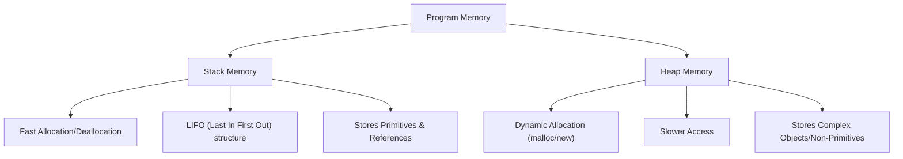

# Data Types - Comprehensive Interview Guide

Data types are the foundation of programming and system design. Interviewers frequently use data types to test your understanding of memory management, optimization, compilation, and language-specific nuances.

---

## 1. What is a Data Type?

A **Data Type** is a classification of data that tells the compiler or interpreter how the programmer intends to use the data. It defines:
1. The **values** that a variable can take.
2. The **operations** that can be performed on the data.
3. The **memory representation** (how many bits are allocated and how they are interpreted).

---

## 2. Primitive vs. Non-Primitive (Composite) Data Types

| Property | Primitive Data Types | Non-Primitive (Composite) Data Types |
| :--- | :--- | :--- |
| **Definition** | Pre-defined (built-in) by the programming language. | Created by the programmer or standard libraries using primitive types. |
| **Value** | Contains a single raw value. | Refers to a collection of values or an object. |
| **Memory Size** | Always fixed (e.g., `int` is 4 bytes). | Dynamic/Variable size depending on contents. |
| **Memory Allocation**| Usually allocated on the **Stack**. | Usually allocated on the **Heap** (references on the Stack). |
| **Examples** | `int`, `float`, `char`, `boolean`, `double`, `pointer` | `Array`, `String`, `Struct`, `Union`, `Class`, `Interface` |

### Deep-Dive: Under-the-Hood Representation of Primitives

#### 1. Integers (Signed vs. Unsigned)
*   **Signed Integers**: Can represent both positive and negative values. They use **Two's Complement** representation under the hood.
    *   *Why Two's Complement?* It simplifies hardware arithmetic circuits (addition and subtraction can be treated the same way) and avoids the problem of "negative zero" (`-0`).
    *   *Formula for N-bit Signed Int:* Range is $[-2^{N-1}, 2^{N-1} - 1]$.
*   **Unsigned Integers**: Can only represent non-negative values.
    *   *Formula for N-bit Unsigned Int:* Range is $[0, 2^N - 1]$.
*   **Interview Gotcha: Integer Overflow**
    *   If you exceed the maximum value of a signed integer (e.g., `2147483647` for a 32-bit signed int), it wraps around to the minimum negative value (`-2147483648`).
    *   In languages like Python, integers have arbitrary precision (they automatically grow to fit larger values), but in low-level languages like C/C++/Java, you must be careful about overflow.

#### 2. Floating-Point Numbers (`float` & `double`)
*   Represented using the **IEEE 754 Standard**.
*   A float is divided into three components:
    $$\text{Value} = (-1)^{\text{sign}} \times \text{fraction} \times 2^{\text{exponent}}$$
*   **Precision Levels**:
    *   **Single Precision (float)**: 32 bits (1 sign, 8 exponent, 23 mantissa/fraction).
    *   **Double Precision (double)**: 64 bits (1 sign, 11 exponent, 52 mantissa/fraction).
*   **Interview Gotcha: Precision Issues**
    *   Since computers represent floating-point numbers in binary, fractions like `0.1` cannot be represented precisely.
    *   *Example:* In Python/JavaScript, `0.1 + 0.2` results in `0.30000000000000004` instead of exactly `0.3`.
    *   *Fix:* When comparing floats for equality, use a tiny tolerance value (epsilon): `abs(a - b) < 1e-9`.

---

## 3. Abstract Data Types (ADTs) vs. Concrete Data Structures

This is a classic conceptual question.

*   **Abstract Data Type (ADT)**:
    *   A **logical description** or specification of data and operations.
    *   It tells you **WHAT** the data type does, but not **HOW** it does it.
    *   *Analogy:* A car dashboard (you press the accelerator, speed increases; you don't care how the engine injects fuel).
    *   *Examples:* `List`, `Stack`, `Queue`, `Map`, `Set`, `Priority Queue`.

*   **Data Structure**:
    *   The **concrete physical implementation** of an ADT in memory.
    *   It defines **HOW** the operations are executed.
    *   *Examples:*
        *   The `Stack` ADT can be implemented using an **Array** or a **Linked List**.
        *   The `Map` ADT can be implemented using a **Hash Table** or a **Red-Black Tree** (BST).

---

## 4. Stack vs. Heap Memory Allocation

When a program runs, it organizes memory into two main areas:

| Feature | Stack | Heap |
| :--- | :--- | :--- |
| **Access Speed** | **Extremely Fast** (direct instruction-level access). | **Slower** (requires pointer dereferencing). |
| **Allocation Rule** | Managed automatically by the CPU. | Managed by the programmer (C/C++) or Garbage Collector (Java/Python). |
| **Size Limit** | Small and fixed (can trigger `StackOverflowError`). | Large and dynamic (limited by system RAM). |
| **Data Lifetime** | Exists only within the scope of the function execution. | Exists until explicitly deleted or garbage collected. |

### Value Types vs. Reference Types
*   **Value Types** (`int`, `float`, `struct` in C++): The actual data is stored directly in the Stack. Copying a value type creates an entirely independent duplicate.
*   **Reference Types** (`object`, `class instance`, `array`): The Stack stores the *memory address* (reference), which points to the actual data stored in the Heap. Copying a reference type only copies the address, so both variables point to the same object in the Heap.

---

## 5. Typing Systems: Static vs. Dynamic & Strong vs. Weak

Languages are classified by how they check types and how strictly they enforce them.

### Static vs. Dynamic (When is type checked?)
*   **Statically-Typed** (Java, C++, Rust, Go):
    *   Types are checked at **Compile-time**.
    *   You must declare variable types explicitly (or compiler infers them once).
    *   *Benefit:* Fewer runtime errors; compiler optimizes performance based on known sizes.
*   **Dynamically-Typed** (Python, JavaScript, Ruby):
    *   Types are checked at **Runtime**.
    *   Variables can hold any type of value and change over time.
    *   *Benefit:* Fast development and flexibility.

### Strong vs. Weak (How strictly are types enforced?)
*   **Strongly-Typed** (Python, Java):
    *   Implicit conversions between incompatible types are disallowed.
    *   *Example (Python):* `1 + "2"` throws a `TypeError`.
*   **Weakly-Typed** (JavaScript, C):
    *   Implicit type coercion is performed automatically.
    *   *Example (JavaScript):* `1 + "2"` results in the string `"12"`.

---

## 6. Mutability vs. Immutability

Understanding mutability is crucial for concurrency, hashing, and memory optimization.

*   **Mutable**: The object's state/data can be modified in-place after creation without changing its memory address.
*   **Immutable**: The object's state *cannot* be modified. Any modification creates a brand-new object in memory.

### Python Mutability Breakdown
*   **Immutable Types**: `int`, `float`, `str`, `tuple`, `bool`, `frozenset`.
*   **Mutable Types**: `list`, `dict`, `set`, user-defined classes.

### Interview Scenario: Why are Dictionary Keys required to be Immutable?
1.  Dictionaries use a **Hash Table** under the hood.
2.  When you insert a key-value pair, the hash of the key is calculated: `hash(key)`. This determines the bucket/index where the value is stored.
3.  If the key were mutable (e.g., a list) and its contents changed, its hash would also change.
4.  If you try to retrieve the value later, the computer calculates the new hash, looks in the wrong bucket, and fails to find the value (or corrupts the table).
5.  Therefore, keys must be **immutable** (hashable) to guarantee their hash remains constant over time.

---

## 7. Crucial Interview Q&A & Cheat Sheet

### Q1: Explain the difference between `NULL`, `undefined`, and `void`.
*   **`NULL` / `None` / `null`**: Represents the *intentional absence* of any object value. It is an assigned value meaning "nothing".
*   **`undefined`** (mainly JavaScript): Represents a variable that has been declared but has not yet been assigned a value.
*   **`void`** (C/C++/Java): A type specifier indicating that a function does not return any value, or a pointer (`void*`) that has no associated data type.

### Q2: What is "Pass-by-value" vs. "Pass-by-reference"?
*   **Pass-by-value**: The function receives a copy of the argument's value. Changes inside the function do not affect the original variable.
*   **Pass-by-reference**: The function receives the actual reference (address) of the argument. Changes inside the function modify the original variable.
*   *The Python Nuance ("Pass-by-object-reference" or "Pass-by-sharing"):*
    *   If you pass a mutable object (like a list) and modify it in-place, the change is reflected outside.
    *   If you pass an immutable object (like an integer) and modify it, Python creates a new local object, leaving the original unchanged.

### Q3: What is Type Coercion?
*   Type coercion is the automatic or implicit conversion of values from one data type to another (e.g., converting a number to a string to perform string concatenation).

---

## Summary Cheat Sheet for Space Complexity
*   **Boolean / Byte**: 1 byte
*   **Char**: 1 byte (ASCII) or 2 bytes (Unicode / UTF-16 in Java)
*   **Short**: 2 bytes
*   **Int**: 4 bytes
*   **Float**: 4 bytes
*   **Long / Double / Pointer (64-bit machine)**: 8 bytes
